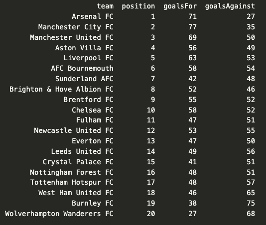
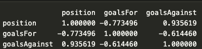

# What Can Premier League Standings Tell Us About The Value Of A Good Defense?

Recently, I've started looking into data science, I went through tutorials on W3schools
on Pandas and Matplotlib. To really test my skills and cure my curiousity, I decided 
to work on real-life premier league data.

For this project, I used data from [Football-data.org](https://www.football-data.org/)
to look at the Premier League table and investigate whether goals scored and
goals conceded were related to where a team finished in the table.
WHat I was really trying to find out was wether having a good defense was more valuable
than having a good offense

## Getting the data

I used an API to retrieve the Premier League standings and converted the data
into a Pandas DataFrame(This step took a while and a bit of documentation reading)

I then extracted the information I was interested in:

- League position
- Goals scored
- Goals conceded

## Visualising the table

I decided to start by plotting the points of the top 10 teams.

The graph makes it much easier to compare the teams than simply looking at
the numbers in a table.

## Looking at correlations

I then calculated the correlation between league position and both goals
scored and goals conceded.

The results were:

- Position vs goals scored: **-0.773**
- Position vs goals conceded: **0.936**

The correlation between position and goals conceded was incredibly strong.
The value of 0.936 suggests a very strong positive relationship between the
two variables. Therefore suggesting that having a better defense means you place higher
in the league table(However this is not a causation)

This makes sense when considering how league position is represented:
1st is better than 20th. As the position number increases, teams generally
have conceded more goals.

There was also a strong negative correlation between position and goals
scored. This suggests that teams higher in the table generally scored more
goals.

This was a relatively simple investigation, so I don't want to draw
conclusions that the data can't support.

## What I'd do next

I'd like to investigate this further by looking at other variables like
passes completed, expected goals and assists, key passes, e.t.c.
seeing whether they have stronger relationships with league performance.

Eventually, I want to move beyond simple correlations and build models that
can actually investigate football performance in more depth.

---

